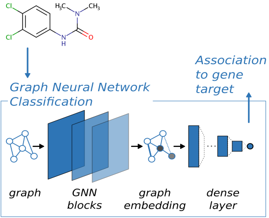

# DeepFPlearn<sup>+</sup>

Link molecular structures of chemicals with multiple targets.

DeepFPlearn<sup>+</sup>[[1]](#1) transforms chemical SMILES or InChIkeys into molecular graph representations for use in a graph
neural network (GNN) that predicts an association to a target molecule, e.g., a receptor protein.



DeepFPlearn<sup>+</sup> is an extension of deepFPlearn[[2]](#2), which uses binary fingerprints to represent the
molecule's structure computationally.

## Setting up Python environment

The DFPL package requires a particular Python environment to work properly.
It consists of a recent Python interpreter and packages for data-science and neural networks.
The exact dependencies can be found in the
[`requirements.txt`](requirements.txt) (which is used when installing the package with pip)
and [`environment.yml`](environment.yml) (for installation with conda).

You have several ways to provide the correct environment to run code from the DFPL package.

1. Use the automatically built docker/Singularity containers
2. Build your own container [following the steps here](container/README.md)
3. Setup a python virtual environment
4. Set up a conda environment install the requirements via conda and the DFPL package via pip

In the following, you find details for option 1., 3., and 4.

### Docker container

You need docker installed on you machine.

In order to run DFPL use the following command line

```shell
docker run --gpus GPU_REQUEST registry.hzdr.de/department-computational-biology/deepfplearn/deepfplearn:TAG dfpl DFPL_ARGS
```

where you replace

- `TAG` by the version you want to use or `latest` if you want to use latest available version)
- You can see available tags
  here https://gitlab.hzdr.de/department-computational-biology/deepfplearn/container_registry/5827.
  In general a container should be available for each released version of DFPL.
- `GPU_REQUEST` by the GPUs you want to use or `all` if all GPUs should be used (remove `--gpus GPU_REQUEST` if only the
  CPU should)
- `DFPL_ARGS` by arguments that should be passed to DFPL (use `--help` to see available options)

In order to get an interactive bash shell in the container use:

```shell
docker run -it --gpus GPU_REQUEST registry.hzdr.de/department-computational-biology/deepfplearn/deepfplearn:TAG bash
```

### Singularity container

You need Singularity installed on your machine. You can download a container with

```shell
singularity pull dfpl.TAG.sif docker://registry.hzdr.de/department-computational-biology/deepfplearn/deepfplearn:TAG
```

- replace `TAG` by the version you want to use or `latest` if you want to use latest available version)
- You can see available tags
  here https://gitlab.hzdr.de/department-computational-biology/deepfplearn/container_registry/5827.
  In general a container should be available for each released version of DFPL.

This stores the container as a file `dfpl.TAG.sif` which can be run as follows:

```shell script
singularity run --nv dfpl.TAG.sif dfpl DFPL_ARGS
```

- replace `DFPL_ARGS` by arguments that should be passed to DFPL (use `--help` to see available options)
- omit the `--nv` tag if you don't want to use GPUs

or you can start a shell script (look at [run-all-cases.sh](scripts/run-all-cases.sh) for an
example)

```shell script
singularity run --nv dfpl.sif ". ./example/run-multiple-cases.sh"
```

It's also possible to get an interactive shell into the container

```shell script
singularity shell --nv dfpl.TAG.sif
```

**Note:** The Singularity container is intended to be used on HPC cluster where your ability to install software might
be limited.
For local testing or development, setting up the conda environment is preferable.

### Set up DFPL in a python virtual environment

From within the `deepFPlearn` directory call

```
virtualenv -p python3 ENV_PATH
. ENV_PATH/bin/activate
pip install ./
```

replace `ENV_PATH` by the directory where the python virtual environment should be created.
If your system has only python3 installed `-p python3` may be removed.

In order to use the environment it needs to be activated with `. ENV_PATH/bin/activate`.

### Set up DFPL in a conda environment

To use this tool in a conda environment:

1. Install mamba. For details follow the installation guide here. https://mamba.readthedocs.io/en/latest/mamba-installation.html#mamba-install}
2. Create the mamba env from scratch

   From within the `deepFPlearn` directory, you can create the conda environment with the provided yaml file that
   contains all information and necessary packages

   ```shell
   mamba env create -f environment.yml
   ```

3. Activate the `dfpl_env` environment with

   ```shell
   mamba activate dfpl_env
   ```

4. Install the local `dfpl` package by calling

   ```shell
   pip install --no-deps ./
   ```

## Prepare data

DFPL can calculate fingerprints of chemical structures from SMILES or INCHI representation. Therefore, e.g. CSV
input-files need to contain a `"smiles"` or `"inchi"` which is then used to calculate the fingerprints. There is an
example CSV file in the `tests/directory` directory and when you're training using the DFPL package, it will load the
input files and add fingerprints. You can test the conversion

```python
import dfpl.fingerprint as fp

fp.importDataFile("tests/data/smiles.csv")
```

If you're data is in CSV format, has a header row, and contains a `"smiles"` or an `"inchi"` column, you can use it as
input for training as it is. However, if you're data is in a different format, you can use function in the `fingerprint`
module to import it correctly.

The `tests/data/inchi.tsv` contains data in TSV format without a header row which makes it impossible to identify how to
import it automatically. You can use the `import_function` argument to tell `importDataFile` how it can turn your data
into a Pandas `DataFrame` that contains, e.g. an `"inchi"` column. After that DFPL can calculate and add the
fingerprints to the `DataFrame`

```python
import pandas as pd
import dfpl.fingerprint as fp

data = fp.importDataFile(
    "tests/data/inchi.tsv",
    import_function=(lambda f: pd.read_table(f, names=["toxid", "inchi", "key"]))
)
```

You can store the converted data as a "pickle" file which is a binary representation of the Pandas dataframe and can be
used directly as input file for the DFPL program. The advantage is that the fingerprint calculation needs to be done
only once and loading these files is fast.

```python
data.to_pickle("output/path/file.pkl")
```

Note that the file-extension needs to be `"pkl"` to be identified correctly by DFPL. Also, you might want to look at
the `convert_all` function in the `fingerprint` module that we use to convert different data-files all at once.

# Running deepFPlearn

Here you will find example code for running deepFPlearn in all five modes:

- **train**
- **predict**
- **traingnn**
- **predictgnn**
- **convert**

The input data for each of these modes can be found in the `example/data` folder. The pre-computed output of the `train`
mode can be found in the assets of the release, for the `predict` mode it is stored in the
respective `example/results_predict` folder. Trained models that are used in the prediction mode are stored in
the `models` folder.

## Train

The train mode is used to train models to predict the association of molecular structures to biological targets. The
encoding of the molecules is done based on molecular fingerprints (we chose 2048 as the fp length). The training data
contains three targets and you may train models for each using the following command:

```shell
python -m dfpl train -f example/train.json
```

Training with the configurations from the `example/train.json` file will take approximately 4 minutes on a single CPU.
The trained models, training histories, respective plots, as well as the predictions on the test data are stored in the
`example/results_train` folder as defined in the `example/train.json` file (this can be changed).

- `configFile or -f`: The path to the `train.json` options file that provides various configurations for training the
  model.
- `outputDir`: The directory where the trained models and other output files will be saved.
- `trainAC`: Whether to train an autoencoder model.
- `aeType`: Whether to train a deterministic or variational autoencoder
- `split_type` and `aeSplitType`: The type of data splitting used for training. Options
  are `scaffold_balanced`, `random`, or `molecular weight`.
- `fpType`: The type of fingerprint used.
- `fpSize`: The size of the fingerprint.
- `fnnType`: The type of Feedforward Neural Network used.
- `optimizer`: The optimization algorithm used.
- `lossFunction`: The loss function used.
- `epochs`: The number of training epochs.
- `batchSize`: The size of the training batch.
- `learningRate`: The learning rate for the optimizer.
- `l2reg`: The L2 regularization parameter.
- `wabTracking` or `aeWabTracking`: Whether to use Weights and Biases (WANDB) for tracking.
- `wabTarget`: The target metric for WANDB tracking.

## Predict

The `predict` mode is used to predict the from molecular structures. Use this command to predict the provided data for
prediction:

```shell
python -m dfpl predict -f example/predict.json
```

The compounds are predicted with the provided model and results are returned as a float number between 0 and 1.

- `inputFile`: The path to the input file containing the molecules to be predicted.
- `outputDir`: The directory where the output file will be saved.
- `outputFile`: The name of the output file containing the predicted values.
- `ecModelDir`: The directory where the autoencoder model is saved.
- `ecWeightsFile`: The name of the file containing the weights of the autoencoder. This is not needed for predicting
  with an AR model.
- `fnnModelDir`: The directory where the FNN model is saved.
- `compressFeatures`: Whether to compress the features using the autoencoder or not.
- `trainAC`: Whether to train a new autoencoder or use a pre-trained one.
- `trainFNN`: Whether to train a new FNN model or use a pre-trained one.

## Traingnn

```shell
python -m dfpl traingnn -f example/traingnn.json
```

The `traingnn` mode is used to train models using a graph neural network to predict the chemical-biological associations
from molecular structures. If the training data contains multiple targets the GNN will perform nultilabel
classification.

The trained models, training histories, and respective plots, as well as the predictions on the test data, are stored
in the `example/results_traingnn` folder as defined in the `example/traingnn.json` file (you may change this). Similar
and even more options are offered via the GNN model. Go to `chemprop/args.py` to take a peek and set your options.

Some basic arguments include:

- `data_path`: Specifies the path to the dataset in CSV format. This is where the model will read the training data
  from.

- `save_dir`: The directory where the trained model and any generated output files will be saved. Make sure the
  directory exists or can be created.

- `epochs`: The number of training epochs.

- `num_folds`: The number of folds to use for cross-validation. Cross-validation is a resampling procedure used to
  evaluate machine learning models on a limited data sample.

- `metric`: The primary metric used for model evaluation. In this case, it's "accuracy".

- `loss_function`: Specifies the loss function to be minimized during training. Here, it's set to "
  binary_cross_entropy".

- `split_type`: Defines the strategy used for splitting the data into training and test sets.
  The **"random"** option will randomly split the data.
  The **"scaffold_balanced"** based on the chemical scaffold (It also logs stats of the split).
  The **molecular_weight** puts the small molecules in training and large in the test set based on their MW.

- `dataset_type`: Specifies the type of problem you are solving; i.e classification.

- `smiles_columns`: The name of the column in the CSV file that contains the SMILES strings of the molecules.

- `extra_metrics`: A list of additional metrics that you want to compute for model evaluation.
  These could include metrics like "balanced_accuracy", "(AUC)", "F1 score", "Matthews Correlation Coefficient (MCC)", "
  recall", "specificity", and "precision".

- `hidden_size`: Specifies the size of the hidden layers in the neural network. A larger size may capture more complex
  representations but could risk overfitting.

## Predictgnn

```shell
python -m dfpl predictgnn -f example/predictgnn.json
```

The `predictgnn` mode is using trained GNN model to predict these chemical-biological target associations from molecular
structures using a graph neural network.

Again some basic arguments:

- `test_path`: The path to the dataset containing smiles in CSV format.

- `checkpoint_path`: Specifies the path to the trained model checkpoint file, usually with a `.pt` extension.
  This is the model that will be used for making predictions.

- `save_dir`: The directory where the prediction results will be saved.
  Make sure the directory exists or can be created.

- `saving_name`: The name of the CSV file where the predictions will be saved.
  This file will be created in the `save_dir`.

## Convert

The `convert` mode is used to convert `.csv` or `.tsv` files into `.pkl` files for easy access in Python and to reduce
memory on disk.

# References

<a id="1">[1]</a>
Kyriakos Soulios, Patrick Scheibe, Matthias Bernt, Jörg Hackermüller, and Jana Schor.
deepFPlearn<sup>+</sup>: Enhancing Toxicity Prediction Across the Chemical Universe Using Graph Neural Networks.
Submitted to a scientific journal, currently under review.

<a id="2">[2]</a>
Jana Schor, Patrick Scheibe, Matthias Bernt, Wibke Busch, Chih Lai, and Jörg Hackermüller.
AI for predicting chemical-effect associations at the chemical universe level—deepFPlearn.
Briefings in Bioinformatics, Volume 23, Issue 5, September 2022, bbac257, https://doi.org/10.1093/bib/bbac257

For questions or comments please reach out: jana.schor@ufz.de
